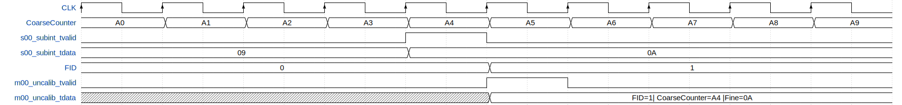
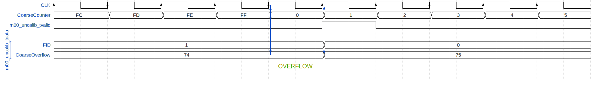

# AXI4Stream Coarse Extension Core (CEC)
This is a Vivado 2017.3 Project, used to extend the fine measure of the TDC with an internal (coming from the *CEC* itself) or external Coarse-Counter (coming from the Coarse Tree Distributor, *CTD*).
The internal/external Coarse-Counter is selected by generic (*CEC_VS_CTD_COUNTER*). The internal counter is provided by the *CoarseCounter_CEC*. Then the *CoarseExtensionCore* is the responsible of creating the *m00_uncalib_tvalid* and the *m00_uncalib_tdata*. Basically the valid goes high when an overflow is detected, not only when a valid input data is present at the input interface (*s00_subint_tvalid*, *s00_subint_tdata*).
In *m00_uncalib_tdata* we find:

  - Fine part uncalibrated of the timestamp, where *s00_subint_tdata* (*BIT_SUB_INT-1 downto 0*) is properly padded into the least-significant part of *m00_uncalib_tdata* from *BIT_UNCALIBRATED-1 downto 0*,
  - Coarse part of the timestamp coming from the internal/external Coarse-Counter (*BIT_COARSE-1 downto 0*) is properly placed into *m00_uncalib_tdata* from *BIT_COARSE + BIT_UNCALIBRATED-1 downto BIT_UNCALIBRATED*,
  - The FID that is the flag used for make the output compatible with the Belt Bus standard. It is placed into the most-significant part of *m00_uncalib_tdata*, *BIT_FID + BIT_COARSE + BIT_UNCALIBRATED-1 downto BIT_COARSE + BIT_UNCALIBRATED*. The FID indicates:
    - a timestamp comes from to a valid *s00_subint* input, if '1'
    - or, an incoming overflow of the Coarse-Counter, if '0'

In the following figure we can see how the CEC pads the FID, the Coarse and the Fine that is coming from the decoder.

The timestamps in input/output of *CoarseExtensionCore* (**CEC**) is an AXI4 Stream interface slave/master.

The figure shows the standard situation for the inputs of the module *CoarseExtensionCore*. The distance between the rising edge of the Event signal and the following rising edge of the clock defines the Fine (subint) part of the timestamp, which is then processed by the Decoder providing two signals, *s00_subint_tvalid* and *s00_subint_tdata*. These signals along with the Coarse-Counter are the inputs of the *CoarseExtensionCore*.

The following figure shows behavior of *CoarseExtensionCore*. The fine part of the timestamp *s00_subint* is integrated with the coarse part coming from the Coarse-Counter, in the case of the valid measure FID is at 1. It represents the case of no overflow.

The *CoarseExtensionCore* is able to report the Overflow of the *Coarse-Counter* keeping at 0 the FID.

Furthermore, in this new version of the *AXI4Stream_CoarseExtensionCore*  the detection of the overflow of the *Coarse-Counter* is entrusted to the *TreeComparator* module.
The structure of the *TreeComparator* is present in the following figure:

In the previous figure we see the case of *BIT_COARSE = 12* and *MAX_INPUT_ENGINE_EQ_PIPELINE_STAGE0 = 3*. According to the *step_TC_pipeline_init* function, that will be explained later in the documentation, we should have 3 stages ( 3 *Step_TC*): in the first *NUM_INPUT_TOT = 8* (basically *NUM_INPUT_TOT* of the first stage is given by (*BIT_DATA* * 2) / *MAX_NUM_BIT_EQ_PIPELINE_STAGE0*) and *MAX_INPUT_ENGINE = 2*. in the second stage *NUM_IN_TOT = 4* (that is 8 / 2) and *MAX_INPUT_ENGINE = 3*, and in the last stage *NUM_INPUT_TOT = 2* and *MAX_INPUT_ENGINE = 3*, but just 2 inputs are needed.
Basically it compares the value of the *Coarse-Counter* with a certain reference (2^BIT_COARSE - 1 - *NUM_STAGE* ), and the output of the *TreeComparator* goes to '1' when the *Coarse-Counter* reaches 2^BIT_COARSE -1. (The subtraction of *NUM_STAGE* is needed for taking into account the delay introduced by the pipeline of the *TreeComparator*) How the *TreeComparator* works, will be explained in detail in the following of the documentation.

What is new in this version of the *AXI4Stream_CoarseExtensionCore* is that we have have included, in addition to the *TreeComparator*, also the *FIFO_Synchronizer* and the *OverflowCounter*.
The *FIFO_Synchronizer* is used to change the clock domain from *clk_TDC* to *clk_SYS*, and it is useful not to loose 2 following measurements, that was the defect of the previous version.
According to the cases that will be explained later, the *FIFO_Synchronizer* will compose the output *uncalib_tdata*: in case of overflow, it is composed by a FID part and a part that contains the value of the *CoarseOverflow_cnt*. Instead in case of measure only, we have the classical FID + COARSE + FINE part. So in other words in output of the module we will have the *CoarseOverflow_cnt* in case of overflow, or the measurement in case of no overflow, as we can see in the following image.

The overflow of the *CoarseCounter* is detected by the *TreeComparator*, and the count of overflows happens internally in the *CoarseExtensionCore* module, so there is no need of including also the *AXI4Stream_OverflowCounter*.
In reality the counting of the overflows can be left to the *AXI4Stream_OverflowCounter*. This can be set by HDL generic *INTERNAL_OVERFLOW_CNT*. If it is TRUE, the CEC counts the overflows, if it FALSE, this task is left to the OC.
In the following figure we can see what happens in case of overflow.

So all in all, with this new version, we have benefits in terms of timing performance (larger slack), since we have included the TreeComparator to perform the comparison for detecting the overflow, that is basically a pipeline, and furthermore we have slowed down the clock signal (From *clk_TDC* to *clk_SYS*), improving the slack of the most critical paths. Moreover we no longer have the problem of loosing data in case of Overflow + Measure, thanks to the *FIFO_Synchronizer*.

# IP-Core

Wrapping of *CoarseExtensionCore* for AXI4-Stream interface for IP-Core.

## Generic

  - **CEC_VS_CTD_COUNTER**: Internal (CoarseExtensionCore, CEC) or External (CoarseTreeDistributor, CTD) Coarse-Counter generation, *STRING* type, default **CEC**.

  - **CEC_COARSE_CNT_INIT**: If *CoarseCounter_CEC* is instantiated the counter is initialized to *CEC_COARSE_CNT_INIT*, *NATURAL* type.
  - **BIT_COARSE**: Bit Dimension of the Coarse part of the Timestamp, *POSITIVE* type *RANGE	2	TO	16*.
  - **INTERNAL_OVERFLOW_CNT**: Generic used for deciding whether to count the overflows in the CEC (if *INTERNAL_OVERFLOW_CNT* is TRUE) or leave the Overfow Counter the task of counting (if *INTERNAL_OVERFLOW_CNT* is FALSE), *BOOLEAN* type.
  - **BIT_SUB_INT**: Bit Dimension of the input data of the Timestamp, *POSITIVE* type *RANGE 2 TO 16*.
  - **BIT_UNCALIBRATED**: Bit Dimension of the Fine part of the Timestamp, *POSITIVE* type *RANGE	2	TO	16*.

  - **BIT_FID**: Bit Dimension of the FID part of the Timestamp, *NATURAL* type. If *BIT_FID = 0* the belt bus is removed and it is a standard AXI4-Stream.

  - **FIFO_MEMORY_TYPE**: Type of FIFO, *STRING* type, default *distributed*.
  - **RELATED_CLOCKS**: Specifies if the wr_clk (*s00_uncalibTDC_aclk*) and rd_clk (*m00_uncalibSYS_aclk*) are related, *BOOLEAN*. If *RELATED_CLOCKS = TRUE*, clk_TDC and clk_SYS are locked.  
  - **FIFO_WRITE_DEPTH**: FIFO Depth, Power of 2, *INTEGER* type *RANGE  16  TO  4194304*, default *16*.
  - **CDC_SYNC_STAGES**: Specifies the number of synchronization stages on the CDC path, *INTEGER* type *RANGE  2  TO  8*, default *4*. It must be < 5 if *FIFO_WRITE_DEPTH = 16*.

  - **MAX_NUM_BIT_EQ_PIPELINE_STAGE0**: Blocks of bits of the inputs that we want to compare in the first stage (Equality comparison), *POSITIVE* type *RANGE 1 TO 16*.

  - **MAX_INPUT_ENGINE_AND_PIPELINE_STAGE1**: Select the max number of inputs for the AND gates in the second stage, *POSITIVE* type.
  - **MAX_INPUT_ENGINE_AND_PIPELINE_STAGE2**: Select the max number of inputs for the AND gates in the third stage, *POSITIVE* type.
  - **MAX_INPUT_ENGINE_AND_PIPELINE_STAGE3**: Select the max number of inputs for the AND gates in the fourth stage, *POSITIVE* type.

## Port

  - **reset**: Asynchronous reset active high (if '1' goto reset state).

  - **clk**: System clock.

  - **CoarseCounter_CTD**: External Coarse-Counter generated to *Coarse Tree Distribution* (CTD).

  - **s00_axis_subint**: AXI4 Stream Slave (Input) interface, uncalibrated data coming from the previous module (Decoder).
      - **s00_axis_subint_tvalid**: Valid of the input data, *STD_LOGIC* type.
      - **s00_axis_subint_tdata**: Fine part of the timestamp padded to upper byte dimension, *STD_LOGIC_VECTOR((((BIT_SUB_INT-1)/8+1)* * *8)-1 downto 0)*  type, used only *STD_LOGIC_VECTOR(BIT_SUB_INT -1 downto 0)* type.

  - **m00_axis_uncalib**: AXI4 Stream master (Output) interface, padding between coarse and fine part with the Fid.
      - **m00_axis_uncalib_tvalid**: Valid of the output data, *STD_LOGIC* type.
      - **m00_axis_uncalib_tdata**: *Fid & Coarse & Fine* part of the timestamp with the proper FID padded to upper byte dimension, *STD_LOGIC_VECTOR((((BIT_FID + BIT_COARSE + BIT_UNCALIBRATED-1)/8+1)*8)-1 downto 0)* type, used only *STD_LOGIC_VECTOR(BIT_FID + BIT_COARSE + BIT_UNCALIBRATED -1 downto 0)* type.

# Sources
We can find in "hdl/" the following module directory:

In "CEC/" we can find:

 - **AXI4Stream_CoarseExtensionCore**: Wrapper used for rename the input and output interfaces with AXI4-Stream for IP-Core, input as slave and output as master.
 - **AXI4Stream_CoarseExtensionCoreWrapper_CEC**: Wrapper used for rename the input and output interfaces with AXI4-Stream for HDL, input as slave and output as master.
 - **CoarseExtensionCore**: Append a Coarse-Count value to the input data (*subint*).
 - **CoarseCounter_CEC**: Counter used for giving the coarse part of the timestamp.
 - **LocalPackage_CEC** Functions and procedures used in the CEC.

In "TreeComparator/" we can find:

 - **TreeComparator**:This is the wrapper of the TreeComparator.
 - **TreeComparatorWrapper**: This module sets the dimensions of the pipeline and builds the tree structure

 - **Step_TC**: The *Step_TC* is the block contained in each stage of the pipeline. It contains the gates that effectively make the comparison: the first *Step_TC* contains only comparator, each one with 2 inputs. The following *Step_TC* contain AND gates, with a number of inputs determined by *MAX_INPUT_ENGINE*.

 - **Engine_EQ_TC**: The *Engine_EQ_TC* is a comparator. It compares *MAX_INPUT_ENGINE_EQ_PIPELINE_STAGE0* bits of *Data* with the corresponding *MAX_NUM_BIT_EQ_PIPELINE_STAGE0* bits of *Ref*.
 - **Engine_AND_TC**: The *Engine_AND_TC* is an AND gate with *NUM_INPUT* inputs. It compares the *NUM_INPUT* bits coming from the previous stages.

 - **LocalPackage_TC**: In this file we find the functions and procedures used in the TreeComparator.

Furthermore we have:

 - **FIFO_Synchronizer**: Wrapper used to instantiate a Xilinx Asynchronous XPM FIFO.

# Simulation
We can find in "src/" the following module directory:

 - **tb_AXI4Stream_CoarseExtensionCore**: HDL simulation of *AXI4Stream_CoarseExtensionCore*
 - **tb_AXI4Stream_CoarseExtensionCore_behv**: Waveform of *tb_AXI4Stream_CoarseExtensionCore*

