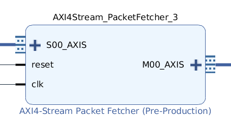

# AXI4-Stream PacketFetcher

### Description

The module decodes a multi-[COBS](https://en.wikipedia.org/wiki/Consistent_Overhead_Byte_Stuffing)-encoded packet. The module istantiates
- a *multicobs_decoder*, which is the one performing the decoding
- a *crc_generator*, to calculate the crc of the input word
- a *data FIFO*, which stores the data of the incoming packets
- a *metadata FIFO*, which will store information about the length and the validity of the packets.

The decoding is based on the multiCOBS algorithm.

The multi-COBS algortihm is the application of the COBS algortihm in parallel on a number of substreams
which is settable by generic. This means that every byte of the input words represents an element of
a different substream. The figure explains the concept, with a number of substreams equal to 4:

The aim is to be able to reach an operating frequency higher than the one available from a single COBS
decoder. In fact, the module will operate in parallel on each substream, wich allows to be able to reach a frequency higher than the original one by a factor equal to the number of substreams.
The figure shows an example with substreams equal to 4:

In this case, assuming a COBS decoder can operate on 8 bits at 100 Mhz, the usage of multiCOBS will allow to reach 3,2 Gbits per second.

The module will so receive, on the input AXI4-Sream port, encoded data, delimited by the packet delimiter (in case of input set to 32 bits, it is `0x00000000`). At the ouput, the module will provide the decoded data, which will be divided into destination and the effective data. It can also give an error signal, which can refer to packet size limitations not being respected, a crc erorr, or an error in the decoding.

## IP-Core

### Generic

- **MAX_PACKET_LENGTH**	:  Maximum length (in Bytes) of the input packet, bigger packets are considered invalid and are automatically flushed.

- **MAX_STORED_PACKETS** :  Maximum number of packets stored in the module, but not yet transmitted.

- **C_REF_IN** : If set to TRUE reflects the input byte.

- **C_REF_OUT** : If TRUE reflects the output CRC_VALUE.

- **C_CRC_POLY**	: Sets the CRC GENERATOR polynomial.

- **C_INIT_VALUE** : Sets the initial value of the crc.

- **C_XOR_OUT**	: Sets the final value with witch the calculated CRC is XORED.

- **C_S_AXIS_TDATA_WIDTH**	:  Sets the size of input tdata.

- **C_M_AXIS_TDATA_WIDTH**	:  Sets the size of output tdata.

- **C_M_AXIS_TDEST_WIDTH**	:  Sets the size of output tdest.

### Port

- **areset**: Asynchronous reset active low. *STD_LOGIC* type.

- **aclk**: Clock signal. *STD_LOGIC* type.

- **s_axis_tvalid**: Slave interface tvalid. *STD_LOGIC* type.
- **s_axis_tdata**	: Slave interface tdata. *STD_LOGIC_VECTOR(C_S_AXIS_TDATA_WIDTH-1 downto 0)* type.
- **s_axis_tready**	:  Slave interface tready. *STD_LOGIC* type.

- **m_axis_tvalid**	:  Master interface tvalid.*STD_LOGIC* type.
- **m_axis_tdata**	:  Master interface tdata. *STD_LOGIC_VECTOR(C_M_AXIS_TDATA_WIDTH-1 downto 0)* type.
- **m_axis_tdest**	:  Master interface tdest. *STD_LOGIC_VECTOR(C_M_AXIS_TDEST_WIDTH-1 downto 0)* type.
- **m_axis_tready**	:  Master interface tready. *STD_LOGIC* type.
- **m_axis_tlast**	:  Master interface tlast. *STD_LOGIC* type.

- **error_code**	:  Signals error.

## Packet description

This module decodes a multiCOBS-encoded
packet with this format (words are Big-Endian, Most-Significant-Bytes
transferred first):

| Header  | Payload   | CRC-32C   | End-Of-Transmission          |
|:-------:|:---------:|:---------:|:----------------------------:|
| 4 bytes | variable  | 4 bytes   | 4 bytes                      |

### Header (4 bytes)

The header is composed by:

| Byte n. | Content         |
|:-------:|:---------------:|
| MSByte  | Reserved        |
| 1       | Reserved        |
| 2       | Reserved        |
| LSByte  | Stream ID (SID) |

The SID is the stream ID, wich can be used to route the stream. For example, for the MME system SID = 0 is used for read stream, SID = 1 is used for write stream

### Checksum CRC (4 bytes)

The CRC of Header + Payload is computed using CRC-32C (CRC POLY `0x1EDC6F41`, INIT VALUE `0xFFFFFFFF`, XOR OUT `0xFFFFFFFF`) unless otherwise specified

### EOF (4 bytes)

The whole Header + Payload + Checksum is encoded with multi-COBS. The end of the packet is signaled with zero word `0x00000000`

***
**WARNING : Information below this line refers to older version and may be not accurate** _TODO: Check them_
***

## IP interface description

### S00_AXIS

Optional signals:

| Signal | Present |
|:------:|:-------:|
| TREADY |    ✓    |
| TSTRB  |    ✗    |
| TKEEP  |    ✓    |
| TLAST  |    ✗    |
| TDEST  |    ✗    |
| TID    |    ✗    |
| TUSER  |    ✗    |

Widths:

| Signal | Width (bits) |
|:------:|:------------:|
| TDATA  |      8       |
| TKEEP  |      1       |

### M00_AXIS

Optional signals:

| Signal | Present |
|:------:|:-------:|
| TREADY |    ✓    |
| TSTRB  |    ✗    |
| TKEEP  |    ✗    |
| TLAST  |    ✓    |
| TDEST  |    ✓    |
| TID    |    ✗    |
| TUSER  |    ✗    |

Widths:

| Signal | Width (bits) |
|:------:|:------------:|
| TDATA  |      32      |
| TDEST  |      4       |
