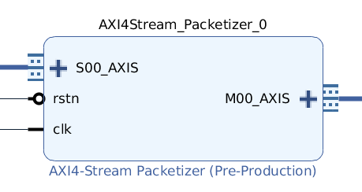

# AXI4-Stream packetizer

### Description

The module encodes the input through the multi-[COBS](https://en.wikipedia.org/wiki/Consistent_Overhead_Byte_Stuffing) algorithm. The module istantiates:

- a *multicobs_encoder*, which is the one performing the encoding
- a *crc_generator*, to calculate the crc of the input word
- a *tdest_fifo* (xpm_fifo_sync), to propagate the TDEST to the output

The multi-COBS algortihm is the application of the COBS algorithm in parallel on a higher number of substreams. This means that every byte of the input words represents an element of
a different substream. The figure explains the concept, with a number of substreams equal to 4:

The aim is to be able to reach an operating frequency higher than the one available from a single COBS
encoder. In fact, the module will operate in parallel on each substream, wich allows to be able to reach a frequency higher than the original one by a factor equal to the number of substreams.
The figure shows an example with substreams equal to 4:

The module takes as input data delimited by tlast on an AXI4-Stream. This data is divided into 32 bits of data and 8 or more bits of TDEST.
The entire TDEST is propagated from input to output through a FIFO, which has read and write enable synchronized with the TLAST signals.
After encoding, the module gives as output frames separated by  `0x00000000`, which acts as the packet delimiter, according to the COBS theory.
The output data does then not contain any occurance of the x"00" byte.
The module can also give an error signal, since the validity of the packets can be checked thanks to the crc_generator.

### TDEST management

The TDEST signal received from S_AXIS has width equal to the TDEST_WIDTH generic. By now, this width can only be equal or higher than eight. The 8 MSBs are utilized for the SID, which is used in the MME for the routing beetween read and write paths, while the remaining LSBs are used in the MME for routing beetween interfaces. The mandatory 8 bits are of course the ones representing the SID. The fact that needs the most attention regards how the TDEST is handled in encoding: in fact, only the bits related to the SID are utilized by the related process (and so used for the crc calculation), this is done by selecting the 8 MSBs of the entire TDEST. It is then necessary to pay attention not to set a TDEST width higher than the one one which is needed, or the crc value will be wrong.

 ## IP-Core

 ### Generic

 - **MAX_PACKET_LENGTH**  :  Maximum length (in Bytes) of the input packet.

 - **C_WORD_WIDTH** : Set WORD_WIDTH in BYTES.

 - **C_REF_IN** : If set to TRUE reflects the input byte.

 - **C_REF_OUT** : If TRUE reflects the output CRC_VALUE.

 - **C_CRC_WIDTH**	:  Set by the CRC GENERATOR POLY (GENERATOR_POLY_ORDER-1).

 - **C_CRC_POLY**	: Sets the CRC GENERATOR polynomial.

 - **C_INIT_VALUE** : Sets the initial value of the crc.

 - **C_XOR_OUT**	: Sets the final value with witch the calculated CRC is XORED.

 - **TDEST_WIDTH** : Sets the width of S_AXIS and M_AXIS TDEST.

### Port

 - **areset**: Asynchronous reset active low. *STD_LOGIC* type.

 - **clk**: Clock signal. *STD_LOGIC* type.

 - **s_axis_tready**	:  Slave interface tready. *STD_LOGIC* type.
 - **s_axis_tdata**	: Slave interface tdata. *STD_LOGIC_VECTOR(32-1 downto 0)* type.
 - **s_axis_tlast**	:  Slave interface tlast. *STD_LOGIC* type.
 - **s_axis_tvalid**	:  Slave interface tvalid.*STD_LOGIC* type.
 - **s_axis_tdest**	:  Slave interface tdest. *STD_LOGIC_VECTOR(TDEST_WIDTH-1 downto 0)* type.

 - **packet_error**	:  Signals a crc error.

 - **m_axis_tvalid**	:  Master interface tvalid.*STD_LOGIC* type.
 - **m_axis_tdata**	:  Master interface tdata. *STD_LOGIC_VECTOR(32-1 downto 0)* type.
 - **m_axis_tready**	:  Master interface tready. *STD_LOGIC* type.
 - **m_axis_tlast**	:  Master interface tlast. *STD_LOGIC* type.
 - **m_axis_tdest**	:  Slave interface tdest. *STD_LOGIC_VECTOR(TDEST_WIDTH-1 downto 0)*

### S00_AXIS

Optional signals:

| Signal | Present |
|:------:|:-------:|
| TREADY |    ✓    |
| TSTRB  |    ✗    |
| TKEEP  |    ✗    |
| TLAST  |    ✓    |
| TDEST  |    ✓    |
| TID    |    ✗    |
| TUSER  |    ✗    |

Widths:

| Signal | Width (bits) |
|:------:|:------------:|
| TDATA  |      32      |
| TDEST  |      TDEST_WIDTH       |

### M00_AXIS

Optional signals:

| Signal | Present |
|:------:|:-------:|
| TREADY |    ✓    |
| TSTRB  |    ✗    |
| TKEEP  |    ✗    |
| TLAST  |    ✓    |
| TDEST  |    ✓    |
| TID    |    ✗    |
| TUSER  |    ✗    |

Widths:

| Signal | Width (bits) |
|:------:|:------------:|
| TDATA  |      32      |
| TDEST  |      TDEST_WIDTH       |
