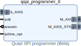
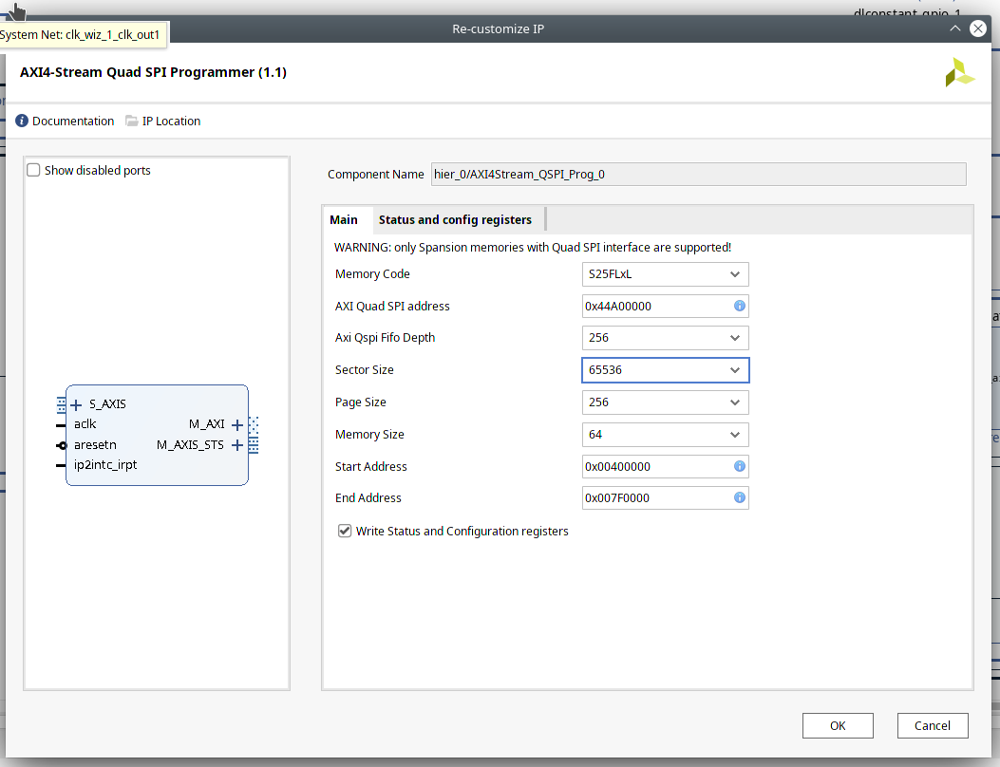
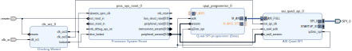
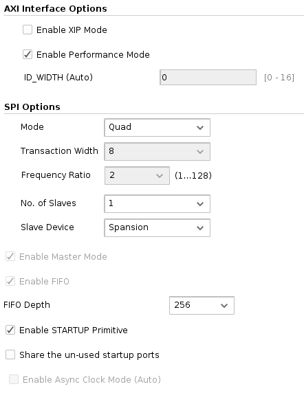

# Quad SPI Programmer



Per la felix rev A e forse rev B (S25FL064LABNFI043) si fa così non fare domande:



### Description

This module can be used to program a Quad SPI memory with a new bitstream from the FPGA itself. This module currently supports **only** Cypress/Spansion memories, like the S25FL256S.

This module has to be used in conjunction with the _Xilinx AXI Quad SPI IP-Core, connected as shown here.



Note that this module uses AXI _FIXED_ bursts, which are not supported by the _Xilinx AXI Smartconnect_ IP-Core: in case another master access to the _AXI Quad SPI_ IP-Core is needed, use a _Xilinx AXI Interconnect_ as interconnect block.

The corresponding _Xilinx AXI Quad SPI_ module should be configured like this:



To write the memory just send the data to be written over `S_AXIS` with `TLAST` asserted on the last byte. At the end of the transmission, or in case of error, the status/error code is sent over `M_AXIS_STS`, a single word with this format (MSB first):

| Size     | Symbol              | Description                                                                     |
|:--------:|:-------------------:|:-------------------------------------------------------------------------------:|
| 8 bits   | RESERVED            | Reserved for future uses                                                        |
| 1 bit    | err_write_conf_reg  | Error while writing a configuration register of the Xilinx AXI Quad SPI IP-Core |
| 1 bit    | err_write_data_reg  | Error while writing the TX data register of the Xilinx AXI Quad SPI IP-Core     |
| 1 bit    | err_read_conf_reg   | Error while reading a configuration register of the Xilinx AXI Quad SPI IP-Core |
| 1 bit    | err_read_data_reg   | Error while reading the RX data register of the Xilinx AXI Quad SPI IP-Core     |
| 1 bit    | err_erase           | The memory has reported an erase error                                          |
| 1 bit    | err_program         | The memory has reported a program error                                         |
| 1 bit    | err_end_addr        | Reached END_ADDRESS                                                             |
| 1 bit    | err_crc             | Invalid trailing CRC32                                                          |

Note that the _Xilinx AXI Quad SPI_ IP-Core has some problematic bugs, if you want to enhance or modify this IP-Core you should read the [list of known bugs](Xilinx_AXI_Quad_SPI_bugs.md).

This IP-Core has been tested on a Nexys 4 (XC7A100T-1C), with an AXI4 clock of 150 MHz and a ext_spi_clk of 60 MHz.

### Constraints

This module doesn't require user constraints, however the corresponding _Xilinx AXI Quad SPI_ does. A sample XDC is provided [in this IPCore](xilinx_axi_quad_spi_sample_constraints.xdc), however the values inside depend on the specific hardware configuration (memory IC setup/hold times, traces delays, ...). Copy the XDC in your project and customize the lines 63-92 accordingly to your system.

### Performance notes

The performance of this IP-Core is limited by the memory IC. SPI memories usually have discrete program/erase performance (max. 750 us for a 256-Bytes page program and 650 ms for a 64-KBytes sector erase on a S25FL128S), however they often have much lower performance on the top/bottom sectors. For example, on the S25FL128S, the erase of the top/bottom 64-KBytes can take up to 10.4 **seconds**. Make sure to adjust the timeout of the data sources accordingly.

### MultiBoot

This module is especially useful with the Xilinx MultiBoot technology, to always have a fallback read-only working bitstream in case of corrupted update. MultiBoot is explained in details in [XAPP1247](https://www.xilinx.com/support/documentation/application_notes/xapp1247-multiboot-spi.pdf), Appendix A.

To use the MultiBoot features, run the Python script `multiboot/multiboot.py` passing as arguments the size of the memory (in MiB) and the size of the erase sectors (in KiB, usually 64 KiB). The printed informations are:

 * **Quad SPI programmer settings**, which are the start and end addresses of the update region (to be set in the configuration of this IP-Core)
 * **Golden/Update image constraints**
 * **Vivado TCL command to generate the golden image**, which can be used to generate the golden SPI image, to be flashed _once_ through the Vivado Hardware Manager
 * **Vivado TCL command to generate the update image**, which can be used to generate all the subsequent update images, to be passed to this IP-Core to safely upgrade the bitstream from the FPGA itself

Optionally, it is also possible to specify the size of the golden image (with the `-g` flag).

The loading of the update image is much faster than the golden one so, even in the case of identical golden/update image, an update image should be flashed in the read-write area.

Together with the multiboot mechanism, the possibility of using memory protection is provided.
This is useful to protect the golden image, while still mantaining the ability to renew the
update bitstream. The mechanism is explained in the "QUAD and memory protection" section.

To optimise the performance of the bitstream loading, make sure to set the bitstream constraints, like in this example:

```
set_property BITSTREAM.GENERAL.COMPRESS TRUE [current_design]
set_property BITSTREAM.CONFIG.SPI_32BIT_ADDR YES [current_design]
set_property BITSTREAM.CONFIG.SPI_BUSWIDTH 4 [current_design]
set_property BITSTREAM.CONFIG.SPI_FALL_EDGE YES [current_design]
set_property BITSTREAM.CONFIG.CONFIGRATE 66 [current_design]

set_property CONFIG_VOLTAGE 3.3 [current_design]
set_property CFGBVS VCCO [current_design]
```

These constraints can also be set in the GUI: _Open Implemented Design -> PROJECT MANAGER Settings -> Configure additional bitstream settings -> Configuration_.

## Generic

- **Memory code** : at the moment only comprehends the options "S25FLxS" and "S25FLxL". As can
    be intuited, this needs to be set according to the device. Pay attention that when
    MEMORY CODE is S25FLxS, the One-Time Programmable (OTP) bit "TBPROT" can be set
    according to other generics explained below (**Write status and configuration registers**,
    **ENABLE PROTECTION** and **ENABLE QUAD**). It is then necessary to pay attention to set
    those generics to "true" only when really needed.

- **AXI QUAD SPI address** : needs to be set only when using an AXI4-Stream interconnect

- **AXI QSPI FIFO depth** : refers to the relative generic of the Xilinx AXI Quad SPI

- **Sector size** : size of the erase sectors

- **Page size** : size of page

- **Memory size** : size of the memory  (in MiB)

- **Start Address** : start address of the considered region

- **End Address** : end address of the considered region

- **Write status and configuration registers** : allows to write some bits in the
    status and configuration registers. If set to "false" nothing will be written in the two
    registers. More information about what can be written when setting this generic to "true" is
    provided in the next section. It is important to note that it is set to "false" as default,
    and should be left as is if there is no need to set memory protection or QUAD bits, to avoid
    unwanted writes into the two registers (which can include One Time Program bits)

## QUAD and memory protection

When selecting to write in the status and configuration registers, the relative GUI page
becomes available. This page allows to set two generics, ENABLE QUAD and ENABLE PROTECTION.

The first one allows to set the QUAD bit in the configuration register, which puts the device into Quad I/O operation. While the usage is intuitive, it is important to note that, when
selecting this option, also the TBPROT bit in the configuration register will be written to 1
(if the selected memory code is "generic").

The ENABLE PROTECTION generic can be used to able/disable memory protection.

To apply memory protection, **Write status and configuration registers** and
**ENABLE PROTECTION** need to be both set to **TRUE** when writing the memory through this IP-core.
To disable memory protection, **Write status and configuration registers** and
**ENABLE PROTECTION** need to be both set to **FALSE** when writing the memory through this IP-core.

Intuitively, memory protection allows to protect a portion of memory from any write operation,
until the protection is disabled manually. This means that any write done through this IP-core
to an area which is being protected will fail, and nothing will be actually written. This also
works for flash programming through Vivado Hardware Manager: in this case an error message will
warn of the error, and communicate that the programming of the memory device has been unsuccessfull.

Memory protection is useful when paired with the multiboot mechanism: in fact, it allows us to
protect the portion of memory which comprehends the golden fallback bitestream, while still
being able to write the update bitstream freely. In this way, we are safe from overwriting the fallback bitstream by mistake, for example by setting a wrong start address when writing the update bitstream.

When the protection is enabled, while doing an operation through this IP-core, the chosen fraction of memory is first protected, by writing the 3 relative bits in the status register (obviously
this means that the protected fraction needs to be written BEFORE being protected).
This allows to protect a portion of memory which is power of two, from 1/2 to 1/64. Protecting a portion lower than 1/64 is not possible.

The chosen portion of protected memory is actually selected "automatically" by using the
**Start Address** generic, and it is the portion that starts from the 00000000 address up
to the one specified **Start Address** generic, rounded to the nearest power of two. Of course, the rounding is to the smallest fraction.
