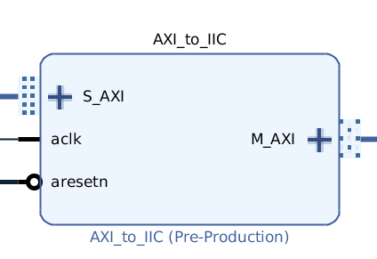
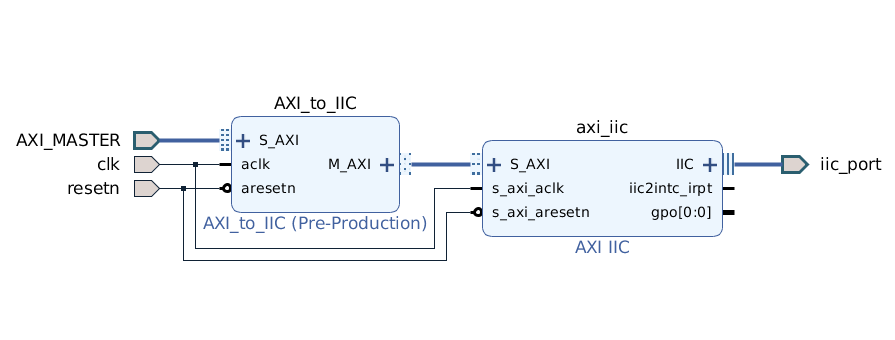

# AXI to IIC

## Description

This module maps devices connected to I2C bus with AXI address.

It works in conjunction with Xilinx [AXI_iic](https://japan.xilinx.com/support/documentation/ip_documentation/axi_iic/v2_0/pg090-axi-iic.pdf) module. Below a typical configuration:

----
## I²C Read operation

The read operation is intended to work on most common I²C modules, where a typical reandom read is performed by writing the start address, and then reading. As reference is reported a figure from microchip 24AA02E48 eeprom that show how random read operation should be performed:

In order to read from I²C bus, an AXI read request should be issued to the following AXI address (relative to module AXI's base address):

| I²C Slave Address | I²C Slave Register | Zero padding (AXI word alignament) |
|:-----------------:|:------------------:|:----------------------------------:|
| 10/7 bits         | 8 bits             | 2 bits                             |

When such request is issued the following I²C operation are issued:

* I²C write to I²C address taken from AXI address (see previous table). The payload of the write transfer is composed by one byte: the I²C Slave Register. In many I²C devices this sets the address to read
* I²C read from I²C address taken from AXI address (see previous table). If more than one byte is requested in AXI read request (S_AXI_ARLEN > 1) a sequential read is performed.
* Data read from I²C is sent whitout any processing on AXI read response port. Each AXI word contains in the LSByte the byte read from I²C. Remaining bytes are set to 0x00.

## I²C Write operation

The write operation is intended to work on most common I²C modules, where a typical reandom write is performed by writing the start address, and then writing the payload bytes.

In order to write to I²C bus, an AXI write request should be issued to the following AXI address (relative to module AXI's base address):

| I²C Slave Address | I²C Slave Register | Zero padding (AXI word alignament) |
|:-----------------:|:------------------:|:----------------------------------:|
| 10/7 bits         | 8 bits             | 2 bits                             |

When such request is issued the following I²C operation is performed:

I²C write is performed to I²C address taken from AXI address (see previous table). The first payload byte is the I²C Slave Register taken from AXI address (see previous table). Following I²C payload bytes are the LSByte of words written to AXI. Remaining bytes in AXI words are ignored. The payload should be written in an atomic AXI full transaction.

## 10 bits Address
The 10 bits I2C address feautures is configurable on the GUI panel of the module and deselecting it results in a lower resource consumption. To address a 10 bit device is necessary to add an offset of 0x70.

_**Example: I2C: 0x000 (10 bit) ---> Slave Address: 0x000+0x70 = 0x70**_

_10bit address mode is not fully tested!_

## Special Registers
I²C standard has 8 reserved addresses. Some of those addresses are used to signal the AXI_to_IIC module status and perform non-I²C operations.

| I²C Slave Address | I²C Slave Register | Zero padding | Read as                                   | Write as                                       |
|-------------------|--------------------|--------------|-------------------------------------------|------------------------------------------------|
| 0x00              | 0x00 -> 0xfc       | 0b00         | Common TDC Header structure               | Slave error (ROnly)                            |
| 0x01              | 0x00               | 0b00         | Error register (see below)                | Slave error (ROnly)                            |
| 0x01              | 0x01               | 0b00         | ??                                        | Probe register (see section Probing)           |
| 0x01              | 0x02               | 0b00         | Config register (see below)               | Slave error (ROnly)                            |
| 0x02              | ??                 | 0b00         | Slave register ???                        | Slave register ???                             |

Error register contains information on errors (if any) of the last I²C transaction, as following (1 represent error, 0 OK):

| Reserved                        | Out of range address | No Read ACK     | No Write ACK    | I²C Slave not present at given address | Special register wrong operation (?) |
|---------------------------------|----------------------|-----------------|-----------------|----------------------------------------|--------------------------------------|
| 27 bits (6th to 32nd bit - MSB) | 1 bit (5th bit)      | 1 bit (4th bit) | 1 bit (3rd bit) | 1 bit (2nd bit)                        | 1 bit (1st bit - LSB)                |

Config register contains information on module configuration, as following:

| Reserved                        | Addressing mode                         | Probe logic                      | Mode                                       |
|---------------------------------|-----------------------------------------|----------------------------------|--------------------------------------------|
| 29 bits (4th to 32nd bit - MSB) | 1 bit (3rd bit); 0 = 10 bit; 1 = 7 bit  | 1 bit (2nd bit); 0 = OFF; 1 = ON | 1 bit (1st bit); 0 = STANDARD; 1 = DYNAMIC |

----
## **Probing**
The probing process begin when the `PROBE REGISTER` is addressed for a write operation. The module try to connect to all devices on the I2C bus sending to them a write operation immediatly followed by a stop I2C sequence as show below:

_NB.: It is **`user`** responsability to control if slave modules connected to I2C bus are compatible with this intended behavior. If this were not the case, the `PROBING` setting must be deasseted._
_NB.: **10 bit address mode** take long time to perform the complete process. The **user** has to configure his system to handle this delay response._

Once a WRITE operation at PROBE REGISTER is completed, the user can read, anytime he wants, the corrisponding registers. 
Registers are filled starting from bit 0 to bit 31 and then passing to the next register. If a slave at the corrisponding address is found the bit is set to '1' else '0'.

----
## **Standard vs Dynamic**
Even if the _Dynamic_ mode is lighter then the _Standard_ one, it does not provide error handling and so it is usable only in
perfectly functional systems. If a slave is not present at that address the module blocks and need an hard reset.
_(This is a Xilinx module problem and cannot be circumvented)_

----
## **Check I2C device timing!**
Unfortunately is not possible to set the dalay between a stop and a start condition because TBUF register of Xilinx I2C module
cannot be modify over the 10 bits(altought the product specification assert the opposite). So it is needed to take a minimum delay
between two command that address the same I2C device as specified on the datasheet of the slave.
