# Memory Management Engine

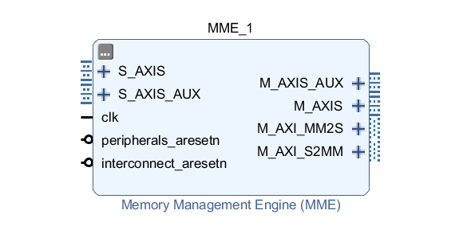

### Description

The Memory Management Engine (MME) is the part of the system which handles memory and communication. It can act as master for the modules to receive data through a bus using the AXI4 protocol, serialize it and then communicate it to the Out Of Chip Communication Interface (OCCI) through an AXI4-Stream bus. Of course, it intervenes also in the opposite operation, in which the data is received by the pc.

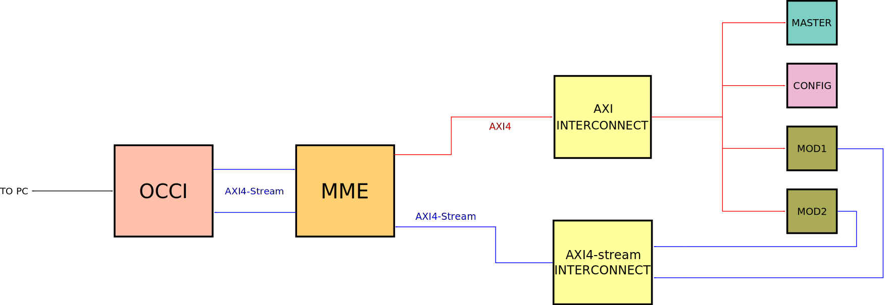

The MME functions as a bridge beetween the AXI4 bus connected to the modules and the AXI4-Stream bus connected to the OCCI, which handles data transfer with the pc. There are significant differences beetween the two protocols:
- The AXI4 protocol is memory-mapped, which means that all transactions involve the concept of a target address within a system memory space and data to be transferred.
- The AXI4-Stream protocol instead is used for applications that typically focus on a data-centric and data-flow paradigm where the concept of an address is not present or not required. Each AXI4-Stream acts as a single unidirectional channel for a handshake data flow.

Consequently, an important task of the MME is to handle the "translation" beetween these two protocols.

<b>Auto Push Function</b>

Each module can implement an Auto Push Function that signals through an AXI4-Stream bus to the MME that a certain memory has to be read. The reading is then done by the MME in the usual way through the AXI4 bus.

## Block design

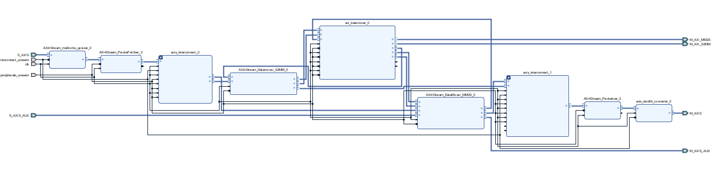

The Memory Managent Engine is composed by:

- An AXI4-Stream multiCOBS Upsizer, which function  is reading the input words (1 byte), and stacking them into an output word with a width which is a multiple of the input width (4 bytes).
- An AXI4-Stream PacketFetcher, which decodes a multi-COBS-encoded packet.
- Two Xilinx's AXI4-Stream Interconnects, which allow multiple masters and slave to be connected.
- An AXI4-Stream DataMover S2MM, which is a simplified interface to the S2MM (write) part of the Xilinx's "AXI DataMover".
- A Xilinx's "AXI DataMover", which is is a soft core that provides the basic AXI4 Read to AXI4-Stream and AXI4-Stream to AXI4 Write data transport and protocol conversion.
- An AXI4-Stream DataMover MM2S, which is a simplified interface to the MM2S (read) part of the Xilinx's "AXI DataMover"
- An AXI4-Stream packetizer, which encodes the input through the multi-COBS algorithm.
- A Xilin's AXI4-Stream Data Width Converter, which decreases the width of a TDATA signal by splitting an AXI4-Stream transfer into a series of smaller transfers.

For more information about these modules, refer to the relative documentation.

## Settings

- The AXI4Stream_multicobs_upsizer is set with default generics, with a 8 bit C_S_AXIS_TDATA_WIDTH and a 32 bit C_M_AXIS_TDATA_WIDTH
- The AXI4Stream_Packetizer is set with default generics.
- The AXI4-Stream DataMover S2MM is set with default Command FIFO depth. The TDEST width
generics are updated automatically based on the "Number of ports" parameter of the MME.
- The AXI4-Stream DataMover MM2S is set with default generics. The TDEST width
generics are updated automatically based on the "Number of ports" parameter of the MME.
The Autopush TDEST parameter is instead set through the equivalent one on the hierarchical
cell.
- The AXI4-Stream PacketFetcher is set with default generics

- The AXI DataMover is set with default generics, except for those that can be set from GUI. Refer to the apposite section

## Reset

Peripherals_aresetn is the reset signal of the AXI4-Stream PacketFetcher, the AXI4-Stream Packetizer, the AXI4-Stream DataMover S2MM, the AXI4-Stream DataMover MM2S, the AXI4Stream_multicobs_upsizer, the AXI4-Stream Data Width Converter and the AXI DataMover. It is active low.

Interconnect_aresetn is the reset signal of the AXI4-Stream Interconnects. It is active low.

Peripherals_aresetn and Interconnect_aresetn should be connected to the relative pin of the Processor System Reset. On the other end, the external interconnects (which are mentioned in the next section) have an ARESETN pin which should be connected to the interconnect pin of the Processor System Reset.

## Placement

The Memory Managent Engine should be able to communicate with the pc, have access to the modules on the FPGA, and manage the auto-push function.

### AXI interconnect

 The AXI interconnect  connects one or more AXI memory-mapped master devices to one or more memory-mapped slave devices. In particular, it is needed to connect the MME to the modules present on the FPGA. The connection to the MME should be done like this:

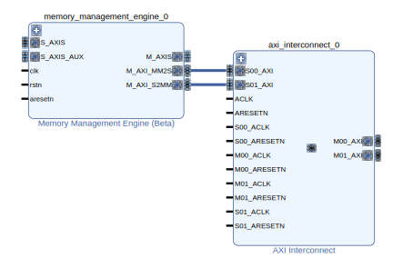

The master interfaces should be connected to the modules. At least the first two interfaces are always needed:

 - M00_AXI should be connected to the slave input of the master module

 - M01_AXI should be connected to the slave input of the config module

The other master ports are optional, and there needs to be one for every other module present on the FPGA.

### AXI4-Stream Interconnect

A second connection needs to be done to manage the auto-push function of the modules, and is usually done through an AXI4-Stream Interconnect.
The AXI4-Stream Interconnect routes connections from one or more AXI4-Stream master channels to one or more AXI4-Stream slave channels. It needs to be istantiated only if more than one module which implements the auto-push function is present. The connection to the MME should be done ike this:

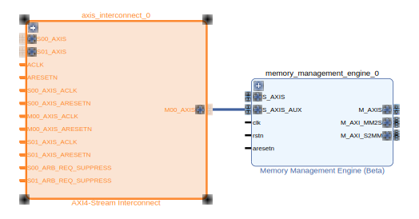

The slave interfaces are instead connected to the master ports of the modules which can request the auto-push.

### Interface IC

 A connection needs to be done with the IC which manages communication with the pc (both as input and as output). This is done through the S_AXIS and M_AXIS interfaces

## Properties

### DataMover Settings

It is possible to set some generics of the AXI DataMover directly from the MME. This comprehends the maximum burst size and the width of BTT fields.

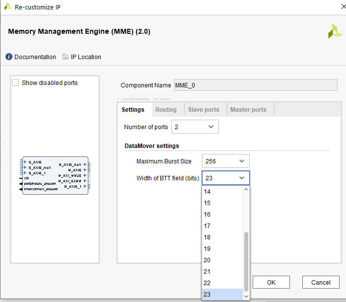

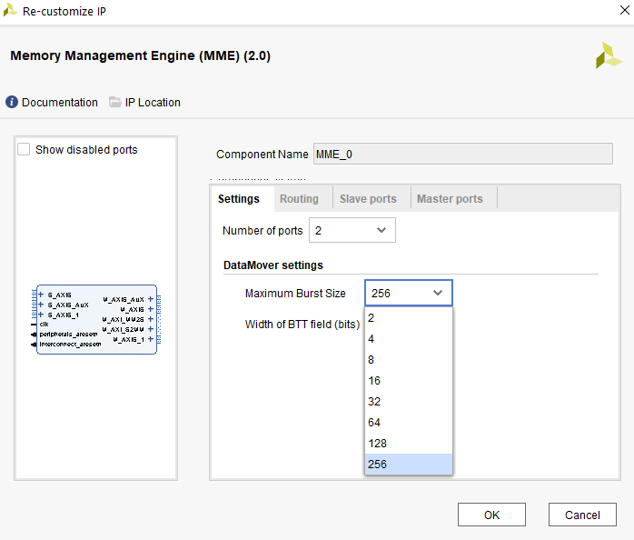

### Number of ports

The "Number of ports" parameter, accessible through GUI, allows to instantiate an MME with multiple interfaces. In this case, the output interface routing is done automatically, depending on the input interface. For example, if the input is S_AXIS_1, the data is redirected to M_AXIS_1. This is done by adding the necessary number of LSBs to the TDEST of the packetizer and the DataMover S2MM and MM2S, while keeping the 8 MSBs for the SID. Additional AXI4Stream interconnects and subset converters are used for the routing.

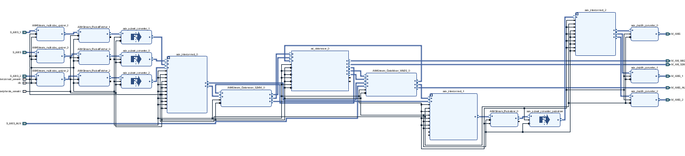

### PTE Auxiliary ports

Allows to create the ports PTE_INPUT and PTE_OUTPUT on the hierarchical cell , which give direct access to the input of the packetizer and the output of the packetfetcher, respectively. Commands at the input of the packetizer have their TDEST filtered by an AXI4Stream_TDEST_filter, which rejects commands which have a TDEST equal to the read or write SID of the MME.

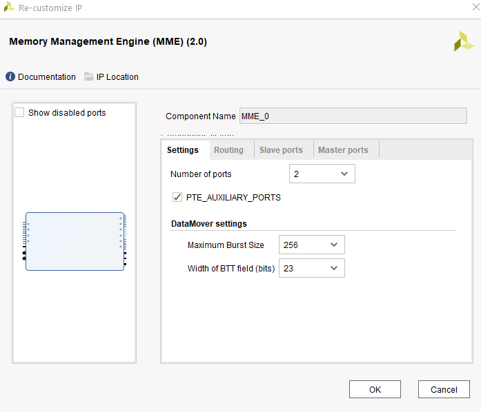

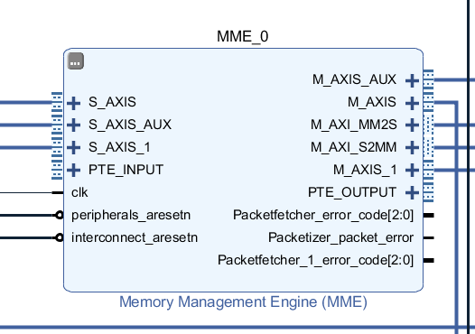

### Routing

The Routing section of the GUI allows to decide the output interface in case of an autopush request. It is of course more relevant in the case of a MME with multiple interfaces, since it allows a choice.

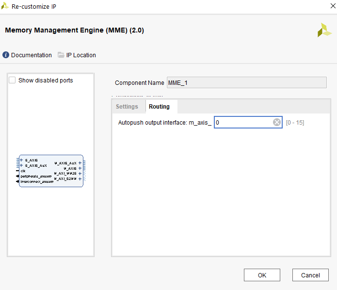

### Slave and master ports

The TDATA width of the S_AXIS and M_AXIS interfaces can be set to either 8 or 32.

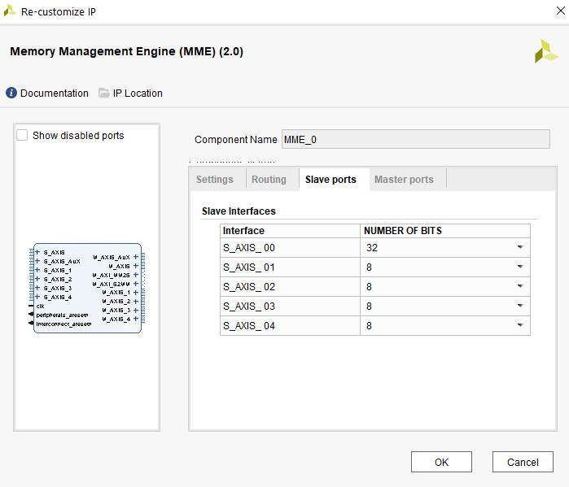

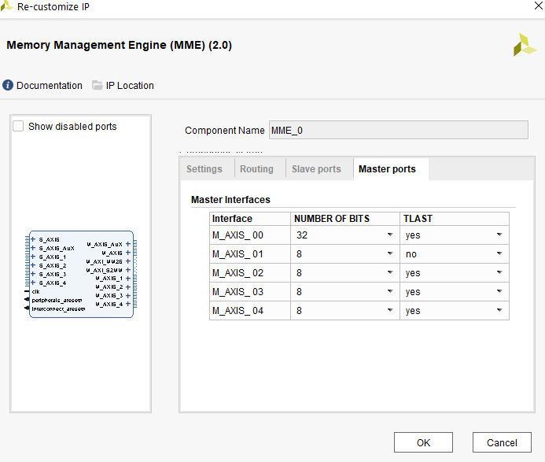

If the width is set to 32, the AXI4-Stream multiCOBS Upsizer and the AXI4-Stream Data Width Converter are not needed (since the width is already the wanted one), and are removed.

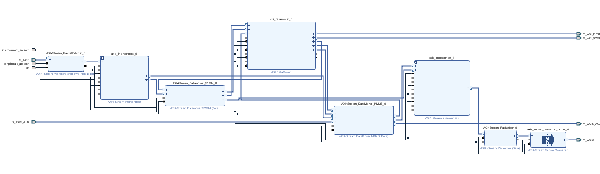

The TLAST parameter (in the second column of the master ports table) allows to decide on asserting the TLAST signal on the last word of the output packet. This may be used to inform the downstream module when a packet has ended.
