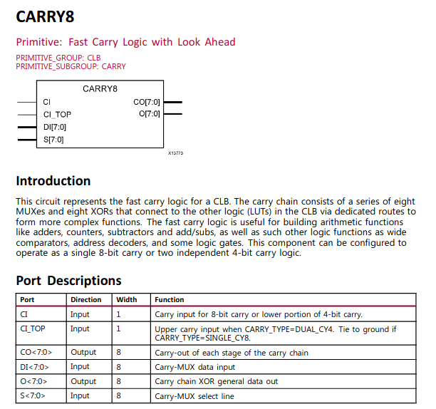
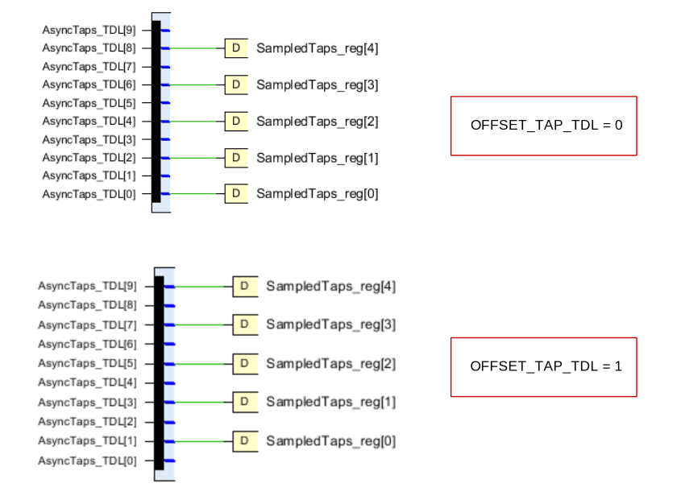
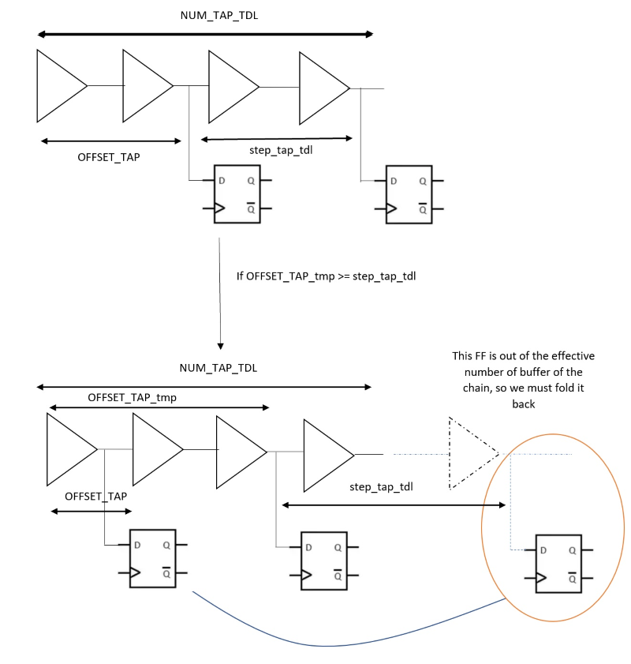
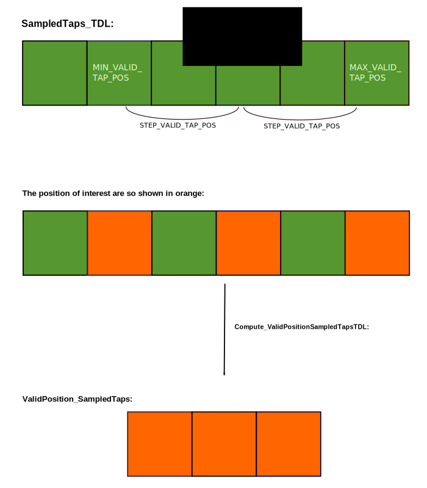
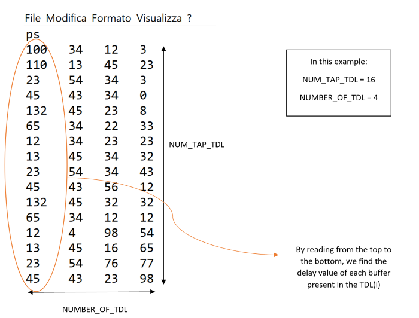
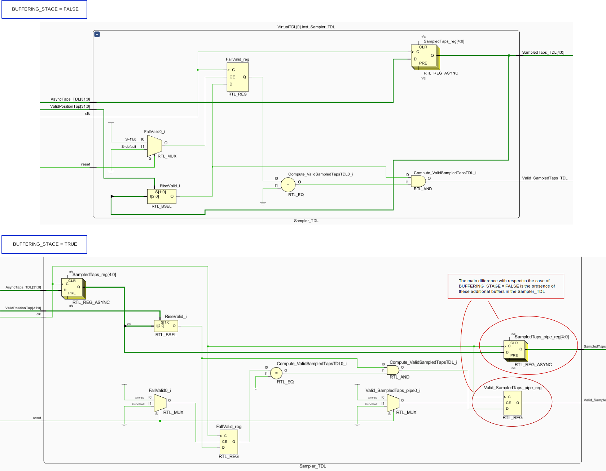
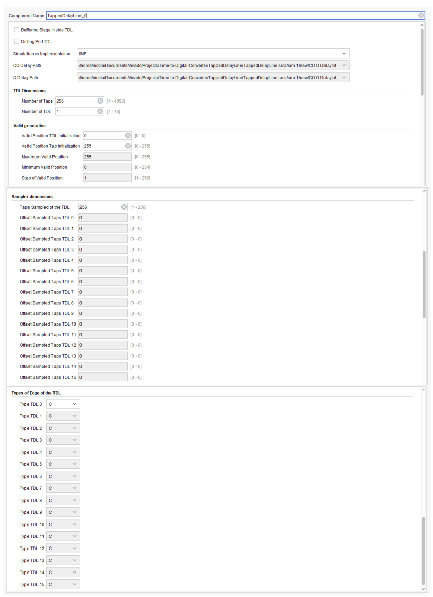
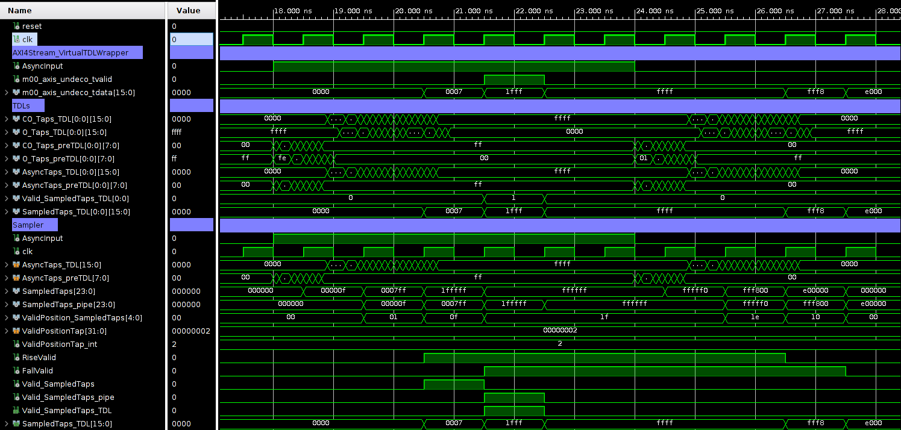

# AXI4-Stream Virtual Tapped Delay-Line (V-TDL)
This is a Vivado 2020.2 Project, AXI4Stream_XUS_VirtualTDL is an auto configurable Virtual Tapped Delay-Line (V-TDL) for Xilinx UltraScale (XUS) based on CARRY8 primitive.

The Virtual Tapped Delay-Line (V-TDL) is able to work with multiple Tapped Delay-Line (TDL) for creating a V-TDL, XUS specifies the compatibility with Xilinx UltraScale (XUS).
The module is composed by a *NUMBER_OF_TDL* of TDLs in parallel, each one composed by *NUM_TAP_TDL* taps, this create a V-TDL with *NUMBER_OF_TDL⋅ NUM_TAP_TDL*.
In the following figure we can see one Tapped Delay-Line, more than these TDLs in parallel creates e V-TDL. We can derive that the propagation delay of a V-TDL is, in average, *NUMBER_OF_TDL* faster than the TDL ones (*tp*) :

We can see the CARRY8 primitive, and the true table in the following image:

Among the *NUM_TAP_TDL* taps, just a *BIT_SMP_TDL* number of taps are sampled. In the following figure we see what have just said:

The previous figure explains the case of *NUM_TAP_TDL = 10* and *BIT_SMP_TDL = 5* with *OFFSET_TAP_TDL = 0* (in the image on top) and *OFFSET_TAP_TDL = 1* (in the image on the bottom). So basically we sample 1 tap out of 2. How the sampling is managed, will be explained later in the documentation of the *Sampler_TDL*.

Furthermore, in reality we have a PRE-TDL before the real TDL Carry Chain that performs effectively the measurement. This PRE-TDL is composed by *NUM_TAP_PRE_TDL* taps and we sample just *BIT_SMP_PRE_TDL* taps. This PRE-TDL is not used for measuring the incoming signal, but it is used just to anticipate the acquisition of the valid before the acquisition of the *AsyncInput* signal.
We can see in the following figure a graphical explanation of this:

We see in the picture that we have a PRE-TDL composed by *NUM_TAP_PRE_TDL* taps and a TDL composed by *NUM_TAP_TDL* taps, but only the *BIT_SMP_TDL* taps of the TDL are then brought in output. The *BIT_SMP_PRE_TDL* together with the *BIT_SMP_TDL* taps of the V-TDL are just used to select the valid, in order to get the valid before the TDL can acquire the signal, in such a way that by changing the position of the valid that we choose, we can move rightwards (if we choose the valid at the last taps of the TDL) or leftwards (if we choose the valid at the taps of the PRE-TDL, by setting a negative MIN_VALID_TAP_POS ) the characteristic curve and the calibration table of the TDC.

Then given in input of the TDLs the asynchronous signal *AsyncInput*, in output we have a sampled version of *AsyncInput*. Basically the series of flip-flops present along the chain samples the incoming signal. In this way a thermometric code in output is generated (*m00_axis_undeco_tdata*). We can notice that the output data (*m00_axis_undeco_tdata*) has a length that is a multiple of 8 and it is in AXI4Stream.
In addition to *BIT_SMP_TDL*, the sampling is managed also by *TYPE_TDL_i* and by *OFFSET_TAP_TDL_i* (i is a value between 0 and 15). Indeed by means of *TYPE_TDL_i*
we choose which taps of the *CARRY8* primitive we want to look at (*CO* taps or *O* taps) for the i-th TDL. Instead by means of *OFFSET_TAP_TDL_i* we can set an initial offset in the sampling chains, which means that the first flip-flop of the i-th TDL is not put in the first position of the chain, but after an *OFFSET_TAP_TDL_i* number of positions.
We can see the concept of offset in the following figure:

In the figure we see on top the case of *NUM_TAP_TDL = 4*, *BIT_SMP_TDL = 2* , *OFFSET_TAP_TDL = 1*. So according to the function *Sample_AsyncTapsTDL*, we have to put 2 FFs, the first has to be put at the second tap and the second has to be put *NUM_TAP_TDL* / *BIT_SMP_TDL* taps later, so at the fourth tap. Instead in the figure on the bottom we see a particular case, that is when the chosen *OFFSET_TAP_TDL* (*OFFSET_TAP_TDL = 2* for example) is equal to (or larger than) the step given by *NUM_TAP_TDL* / *BIT_SMP_TDL*. In this case the second FF would be put at the fifth tap, but we have just 4 taps available since *NUM_TAP_TDL = 4*, and so the second FF is folded back and put after the first tap.

For what concern the search of the valid (*m00_axis_undeco_tvalid*), we have to distinguish two cases, depending on *DEBUG_MODE*.
If *DEBUG_MODE = TRUE* we choose the Valid by means of the ports *ValidPositionTap* (that selects in which sampled taps along the chain we want to extract the valid) and *ValidNumberOfTdl* (that selects in which TDL we want to search the valid).
Furthermore in the case *DEBUG_MODE = TRUE* we have the possibility to select just few of the *SampledTaps* from which we could extract the valid, indeed by means of *MAX_VALID_TAP_POS*, *MIN_VALID_TAP_POS* and *STEP_VALID_TAP_POS* we choose just some flip-flops along the chain from which we select the valid. Among this few flip-flops the final chosen position is selected by *ValidPositionTap*. This concept will be more clearly explained in the following part of the documentation. However a figure that can help in understanding this concept is the following:

The figure shows the case of *MIN_VALID_TAP_POS = 1*, *MAX_VALID_TAP_POS = 5* and *STEP_VALID_TAP_POS = 2*.

Instead if *DEBUG_MODE = FALSE* the valid is chosen by means of the generics *VALID_POSITION_TAP_INIT* and *VALID_NUMBER_OF_TDL_INIT*.
Finally, there is the possibility to just simulate the module, instead of implementing it, and this is the case if *SIM_VS_IMP = "SIM"*.
If *SIM_VS_IMP = "SIM"* we import the simulated delays of the buffers of the chain from the *FILE_PATH_NAME_O_DELAY*  and *FILE_PATH_NAME_CO_DELAY* that are two .txt files containing the delays (of the O taps and of the CO taps respectively) of the fictitious buffers of the simulated TDL. An example of the structure of the .txt file is the following:

Then we can also align the data and the corresponding valid to the same clock pulse, in case of *BUFFERING_STAGE = TRUE*.
We can see in the following figure the difference between the case *BUFFERING_STAGE = TRUE* and the case *BUFFERING_STAGE = FALSE* :

# IP-Core

Wrapping of *AXI4Stream_XUS_VirtualTDLWrapper* for AXI4-Stream interface for IP-Core.

## Generic

  - **TYPE_TDL_i**: CO vs O Sampling TDL, with i in [0; *NUMBER_OF_TDL* -1], *STRING* type, default **C**.

  - **DEBUG_MODE**: True Active the AXI port for moving the Valid Position (Sampled Tap used) and valid Number (TDL used). It allows us to choose the valid by port if it TRUE, *BOOLEAN* type.

  - **SIM_VS_IMP**: Simulation or Implementation, *STRING* type.

  - **FILE_PATH_NAME_CO_DELAY**: Path of the .txt file that contains the CO delays for Simulation, *STRING* type.
  - **FILE_PATH_NAME_O_DELAY**: Path of the .txt file that contains the O delays for Simulation, *STRING* type.

  - **NUMBER_OF_TDL**: Number of TDL in parallel, *POSITIVE* type *RANGE 1 TO 16*.
  - **NUM_TAP_TDL**: Bit of the TDL (number of buffers in the TDL), *POSITIVE* type *RANGE 4 TO 4096*.

  - **BUFFERING_STAGE**: Buffering stage for the valid synch, it allows us to allign the data and the corresponding valid to the same clock pulse, *BOOLEAN* type.

  - **MIN_VALID_TAP_POS**: Minimal position inside SampledTaps used by *ValidPositionTap* to extract the valid, *NATURAL* type.
  - **STEP_VALID_TAP_POS**: Step used between *MAX_VALID_TAP_POS* and *MIM_VALID_POS* for assigned ValidPositionTap, *POSITIVE* type.
  - **MAX_VALID_TAP_POS**: Maximal position inside SampledTaps used by ValidPositionTap to extract the valid, *NATURAL* type.

  - **VALID_POSITION_TAP_INIT**: Initial position along the TDL from which we want to extract the valid in case of DEBUG_MODE= FALSE, *INTEGER* type *RANGE 0 TO 4095*.
  - **VALID_NUMBER_OF_TDL_INIT**: Initial number of TDL from which we want to extract the valid, *INTEGER* type *RANGE 0 TO 15*.

  - **OFFSET_TAP_TDL_i**: The TDL i (with i in [0; *NUMBER_OF_TDL* -1] is sampled with an initial offset of bit respect to the Tap step of *NUM_TAP_TDL* / *BIT_SMP_TDL*, *NATURAL* type *RANGE 0 TO 2047*.

  - **BIT_SMP_TDL**: Bit Sampled from the TDL each *NUM_TAP_TDL* / *BIT_SMP_TDL* after OFFSET_TAP_TDL, obiusly equal in each TDLs. Basically it is the number of Flip Flops, *POSITIVE* type *RANGE 1 TO 4096*.

  - **NUM_TAP_PRE_TDL**: Bit of the PRE-TDL (number of buffers in the PRE-TDL), *INTEGER* type *RANGE 0 TO 256*.
  - **BIT_SMP_PRE_TDL**: Bit Sampled from the PRE-TDL each NUM_TAP_PRE_TDL/BIT_SMP_PRE_TDL after OFFSET_TAP_TDL, obviously equal in each TDLs, *INTEGER* type *RANGE 1 TO 4096*.

  

## Port

  - **reset**: Asyncronous system reset, if '1' goto reset state, *STD_LOGIC* type.

  - **clk**: TDC sampling clock, *STD_LOGIC* type.

  - **AsyncInput**: Asynchronous input data, *STD_LOGIC* type.

  - **m00_axis_undeco_tvalid**: Valid Uncalibrated Virtual TDL, *STD_LOGIC* type.
  - **m00_axis_undeco_tdata**: Data Uncalibrated Virtual TDL, with a length that is a multiple of 8, *STD_LOGIC_VECTOR((((NUMBER_OF_TDL*BIT_SMP_TDL-1)/8+1)*8)-1 DOWNTO 0)* type.

  - **ValidPositionTap**: Position of the bit for generating the valid of Bit of *SampledTaps_TDL*, *STD_LOGIC_VECTOR(31 DOWNTO 0)* type.
  - **ValidNumberOfTdl**: Valid chosen between the *NUMBER_OF_TDL* possible TDLs, *STD_LOGIC_VECTOR(31 DOWNTO 0)* type.

This module instantiates the *AXI4Stream_XUS_VirtualTDLWrapper* and renames the input and the output interfaces with AXI4Stream, input as slave output as master.

# Sources
We can find the following module in *hdl/*:

  - **AXI4Stream_XUS_VirtualTDL**: Wrapping of AXI4Stream_XUS_VirtualTDLWrapper for usage in block design and IP-Core
  - **AXI4Stream_XUS_VirtualTDLWrapper (TDL)**: Wrapping between TDLs and Sampler with axi4 stream output.

  - **Sampler_TDL (TDL)**: Sampling the TDL, with the possibility to decimate the TAPs, and define the valid all syncronized to the input clock.
  - **XUS_TappedDelayLine_CARRY8 (TDL)**: Simple TDL implemented using the CARRY8 primitive for Xilinx UltraScale.

  - **LocalPackage_TDL (TDL)**: Functions for autoconfigurable all the VHDL file.

# Simulation
  We can find the VHDL simulation and relative Waveforms of *AXI4Stream_XUS_VirtualTDLWrapper* in the directory *src/*. It is possible to modify all the parameters.  In the same directory we can find also the file .txt containing the delays for the simulation.

  - **tb_AXI4Stream_XUS_VirtualTDLWrapper**: VHDL simulation of *AXI4Stream_XUS_VirtualTDLWrapper*
  - **tb_AXI4Stream_XUS_VirtualTDLWrapper_behav**: Waveforms of *tb_AXI4Stream_XUS_VirtualTDLWrapper*
  - **CO_Delay.txt**: File that contains the delays of the CO taps for simulation.
  - **O_Delay.txt**: File that contains the delays of the O taps for simulation.

# TODO

1. Solving problems with the simulation on Vivado, like delay before CO(0).
2. Try to improve the time resolution of Vivado, which doesn't allow to see the fs at the moment and truncates the values after the comma if the unit is ps.
3. Do CoSimulation
4. Configuration of debug from AXI4 Lite Slave interface port so implement with different clk domain and check the dimension of ValidPositionTap and ValidNumberOfTdl
5. Insert CARRY8 compatibility for Ultra Scale and Ultra Scale +.
6. Review the doxygen documentation, once Doxygen solves the bug related to the instantiations. (problem present in the hdl wrapper (inst_sampler_tdl) and in the X7S_TDL_CARRY4 (carry4_tdl))
